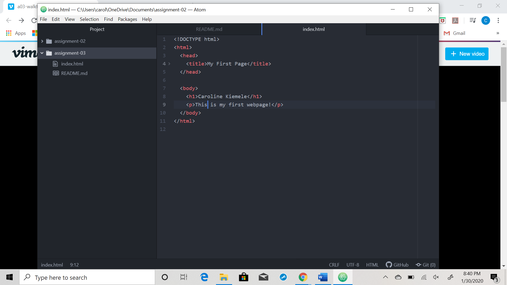

We send requests over the internet to a server.  This server then sends bits of content from a website back to our web browser which then interprets that content and allowing us to use the website that is built from that content.  I primarily use google chrome as it seems the fastest to me, although I do use Microsoft Edge sometimes for school assignments or for my student email.

Markup language is what dictates the set up of the page, focusing on text.  It is the combination of everything on a browser.  HTML structures the page and its contents.  It is the most widely used markup language.  

